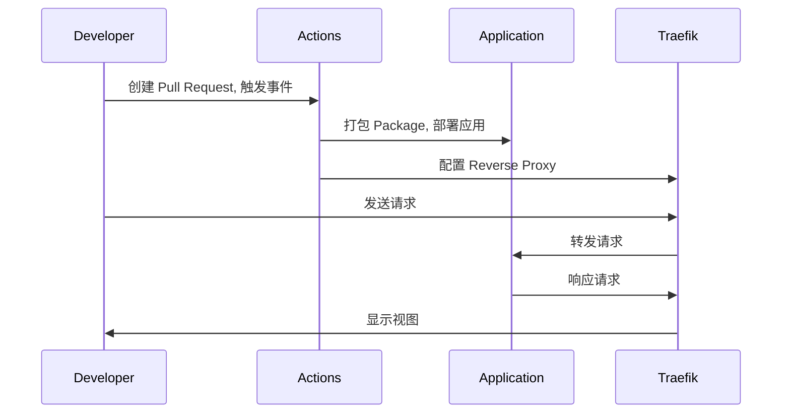

# preview-pullrequest
前端 pr 预览 



## HowTo
```yaml
- name: pr preview
  uses: byzanteam/jet-actions/pr-preview@main
  with:
    values_file: ./deploy/values.local.yaml
    app_name: front-app
    image_tag: "1.0.0"
    ssh_host: IP_Address
    ssh_user: Username
    ssh_port: 22
    ssh_key: ${{ secrets.SSH_KEY }}
    repository_password: ${{ secrets.REPOSITORY_PASSWORD }}
```

添加 secret 参数到 repo 中，`Settings->Secrets and variables->Actions->Repository secrets`:
* SSH_KEY
> base64 encoding ~/.ssh/id_rsa

